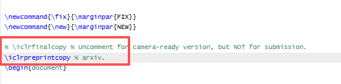

# iclr2026_arxiv
A .sty file with the arxiv option added for the ICLR 2026 template.

The original ICLR 2026 template did not include the arxiv option. ​I have modified it to support preprints. To use it, **simply​ replace the original .sty file** and **add the following line of code to your own .tex file**:

```
\iclrpreprintcopy
```


